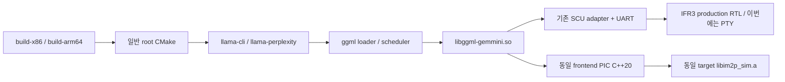

# 일반 llama FPGA_UART build/runtime 통합 — 최종 source02

일반 `build-x86.sh` → root CMake → `llama-cli`/`llama-perplexity` →
배포용 `libggml-gemmini.so` → 기존 SCU adapter → **실제 IFR3 production RTL**
경로를 구현·검증했다. 전용 `scu_host_dispatch`나 experiment parent의 사후 linkage에 의존하지 않는다.

| 수준 | 최종 판정 |
|---|---|
| L1 | PASS: provisioning 전 CLI/env/cache/default 설정 일치 |
| L2 | PASS: 별도 source02 추출 경로에서 native archive와 일반 x86 CLI/PPL fresh build |
| L3 | PASS: 실제 dynamic load, install ELF 8개, RPATH/의존성/재배치 검증 |
| L4 | PASS: 같은 일반 library의 graph 5 GEMM, 실제 SCU RTL, G1/G2 exact |
| L5 | PASS: 설치된 일반 CLI의 prefill/decode 2회 및 일반 PPL의 1회 지원 op dispatch |
| L6 | NOT RUN: AArch64 build/target runtime; native Linux ARM64 recipe 제공 |
| L7 | NOT RUN: 이번 배포 host의 물리 FPGA·사용자 실제 모델 correctness |

L5는 학습되지 않은 작은 synthetic model의 H1 output projection에 한정한다.
실제 GPT-2/Llama 전체 offload, Nano 실행, Flash 부팅, 모델 품질·속도 향상을 뜻하지 않는다.
이번 물리 장치 접근과 programming은 0회다.

## 1. 경로와 원본 identity

- `RUN=/mnt/fpga-build/im2p/llama-fpga-runtime-20260911-02`
- `SEL=$RUN/relocation-02/llama-fpga-source`
- `BUILD=$RUN/final-work/llama-fpga`
- `AUDIT=$RUN/evidence/final-audit-02`
- 최종 설치물: `$RUN/final-runtime-install`
- 파일별 argv/cwd/env/UTC/exit/log: `$RUN/evidence/*.command.json`, `*.status.json`, `*.log`.
  서로 다른 실패·수정 단계의 디렉터리를 보존했다.

| 원본 역할 | 실제 identity |
|---|---|
| Core branch / HEAD | `fix/scu-block-scale` / `3aeb5feee6872f88ec1f6a5dc0d77fb1bb8babf8` |
| Host 실제 branch / pin | `fpga` / `7a74ac29c9c8fa8fbc5d47cf073b8b9266e3e7a9` |
| Include branch / pin | `develop` / `cd2caed8d93e49d3f8873bd6c4e340fcad54b9e0` |
| Frozen integration manifest | `607827f129c61b60dffd9e9fb02fd0ceb4a7ab2abbeb25bd6b08d4d9b2782d69` |
| Board-proven .bit | `2c5516e2bae4d5f960697537bb1501d42470b7971be5986b6e59ad8cc6586984` |
| Routed DCP | `828c09cf0f718c535957c72c4a69bfc954ac306e06f44c467530ef4599004995` |
| Production mkScuPipeline.v | `1833a6a4f53e48fa18f0afb188fbd2858a7584376701a333374025174d061c26` |
| FULL reference | `4da8b84c9d1d2f678491e3b02893bda0065cae1bd4f3cd838ded316f0dd1276c` |
| Reference provenance | `7cfc1e584d076a072aab404746459e105257839346b253a628fc80c56e433987` |

고정 core base `dc4a1a621f63834d64df42ae8c24152747d97971` → FULL fixed-core patch
→ SCU delta → 명시 board overlay의 frozen 선택을 보존한다. Host pin에는 기존
integration → producer observation → SCU companion이 적용돼 있다. 그 결과의
1,746개 파일을 먼저 검증하고 이번 **19개 ordinary-host overlay만** 적용했다.
Root 전체나 최신 develop을 섞거나 patch를 중복 적용하지 않았다.

Sibling의 기존 dirty `build-x86.sh` 의도 6개는 별도 원본 diff로 보존했다:
LOG_DEBUG=1, LOG_CYCLE=1, WS, IM2P_SIM, `../IM2P.sim`, 기본 residual backend WS.
`fpga/scu_runtime/user-build-x86-before.patch`와 `build-options-baseline.json`을 참조한다.
이번 변경은 sibling에 직접 덮어쓰지 않고 versionable `host-overlay/`에 있다.
`$SEL/provenance/host-overlay/{before,after}.json`, `host-before/`,
`$AUDIT/host-source-diffs.json` 및 `host-diffs/`가 파일별 원본/변경/hash를 보존한다.

## 2. 확인한 누락과 실제 수정

| 변경 전 반례 | 최소 수정 / 보존 증거 |
|---|---|
| Stock root CMake에서 FPGA_UART enum 거부 | 일반 root/backend CMake가 profile·ABI5·필수 source/library 소유. stock configure exit1 보존 |
| ARM CLI -D FPGA/D16 전에 SIM/D64 provisioning | 공통 resolver를 provisioning 이전 호출. fake make/cmake T0 argv 보존 |
| Linux ARM에서 Apple flags/library 삭제 | Darwin 경로만 조건화; 기존 binary 삭제 제거 |
| DL MODULE을 default test target에 직접 링크 | 해당 직접-link test만 static 조건화. DL/default tests를 전체 OFF하지 않음 |
| RMD OFF FPGA가 불필요한 WS residual executor 검사를 요구 | FPGA RMD OFF에 한해 불필요한 availability 검사 제외; residual 실행은 추가하지 않음 |
| 초기 zero-byte buffer probe로 지원 backend 배제 | metadata-only loader probe와 실제 backing/capacity 검사 분리 |
| 명시적 FPGA device의 private memory=0으로 split 0/0 | 해당 단일 explicit FPGA의 default scheduling share=1. CAP/메모리 용량 위조 없음 |
| 명시 device의 backend init/architecture 전달 누락·중복 | 모델 architecture 전달, 이미 초기화한 explicit FPGA 중복 init 제외 |
| FPGA 실패 또는 completed0이어도 CLI 성공 가능 | 실제 assignment/adapter attempt/completion/failure 통계와 CLI/PPL exit gate |
| PPL warmup 실패 후 후속 eval 가능, --no-warmup 미지원 | 공통 warmup encode/decode 결과를 즉시 확인·로컬 해제; 기존 옵션을 PPL에도 허용 |

Options/target linkage/dispatch 외의 SCU arithmetic, quantizer, rounding/saturation,
frontend reconstruction, UART/provider/wire/RTL/bitstream/DCP/XDC는 변경하지 않았다.
19개 host overlay와 test/tool 목록은 source02의 manifest에 전부 있다.

## 3. 옵션·provisioning·cache 계약

우선순위: **CLI > environment > 기존 CMake cache > script 기본값**.
`-DVAR=value`, `-DVAR:TYPE=value`, 공백 경로, IM2P_DIM alias를 검사한다.
명시한 profile 충돌은 덮어쓰지 않고 configure 전에 거부한다.
지원하지 않는 preset/toolchain 해석은 script에서 거부하거나 직접 CMake로 분리한다.

| FPGA 설정 | 값 |
|---|---|
| GGML_GEMMINI / EXECUTION_BACKEND | ON / FPGA_UART |
| OPTION / COMPUTE_TYPE / ACTIVATION_QUANT | WS / INT / EXSIA |
| ACTIVATION_BITS / WEIGHT_BITS / DIM / BLOCK_SIZE | 8 / 8 / 16 / 32 |
| ENABLE_RMD | OFF |
| ABI / protocol / capability / output domain | 5 / IFR3 / 0x0294 / 2 |
| numerical | signed-scu-sat-v2 |
| dependency | 명시적 selected source + 같은 architecture의 real-lib.json |

FPGA 선택 시 숨은 simulator provisioning은 없다. 기존 SIM은 최종 effective profile로
기존 provisioning을 사용한다. USB 연결로 backend를 바꾸지 않는다.
Help/dry-run/list/supports는 UART를 열지 않으며 build에 CAP/programming을 넣지 않았다.
FULL/live 선택은 backend와 별개인 `GEMMINI_MATMUL_MODE=FULL|STRIPE_PIPELINE`이다.
기존 `GGML_GEMMINI_ALLOW_RUNTIME_MATMUL_OVERRIDE` 정책을 유지한다.

CMake는 manifest/archive/header의 REALPATH를 고정하여 mutable `current`가 바뀌어도
한 build가 다른 generation을 섞지 않는다. ABI5 getter/numerical probe와 compiler,
profile, source/header/quantizer/params, archive, target OS/arch, PIC/shared/link flags를
fingerprint에 포함한다. 다른 fingerprint는 fresh BUILD_DIR를 요구한다.
Fingerprint는 관련 native/backend 입력용이며 repository 전체 코드의 hash를 대신하지 않는다.
별도 selected-source manifest가 전체 배포 source를 봉인한다.

Native configure는 C++20 `bit_cast`와 실제 ABI getters를 compile/link/run한다.
Cross configure는 target binary를 x86에서 실행하지 않고 compile/link+manifest/ELF 검사를
분리한다. Cross runtime 검사는 NOT RUN이다. ABI4 혼합 허용이나 unknown symbol 우회는 없다.

## 4. 실제 연결 추적

다음 행과 hash는 최종 `SEL` 기준이다. 상세 source SHA는 아래 표와 source02 manifest에 있다.

| 단계 | 파일 / 함수·위치 | 기본·거부·초기화 영향 |
|---|---|---|
| Shell | host/build-x86.sh:58, im2p_resolve_build_options | 기존 dirty 기본값 보존, effective 설정 먼저 |
| Option merge | host/scripts/im2p-build-options.py:33, resolve | CLI/env/cache/default, profile/alias 검사 |
| Provision | host/scripts/im2p-host-provision.sh:60 | FPGA explicit manifest, SIM만 기존 생성 |
| Configure/ABI | host/cmake/ggml-gemmini-fpga.cmake:75, try_run | ABI5 native 실행검사, UART 없음 |
| Fingerprint | 같은 파일:155 | 관련 source/target/flags 변경 거부 |
| Link | host/ggml/src/ggml-gemmini/CMakeLists.txt:207 | adapter/UART 각1회, frontend PIC target, real sim archive |
| Load | host/common/arg.cpp:1228, ggml_backend_load_all | CLI/help/list metadata만 |
| Model init | host/src/llama-context.cpp:124, host/src/llama-model.cpp:1489 | explicit FPGA init·default share, 실제 CAP 완화 없음 |
| Supports | host/ggml/src/ggml-gemmini/ggml-gemmini.cpp:2790 | H1/F32/layout/shape 지원, CPU 최초 배정과 구분 |
| Scheduler | host/ggml/src/ggml-backend.cpp, backend_from_buffer / graph_compute_async | 실제 buffer·supports에 따라 배정; 강제 assign harness 아님 |
| Args/producer | host/ggml/src/ggml-gemmini/ggml-gemmini.cpp:1275 | 기존 quantizer/geometry/EXSIA producer |
| Assigned/dispatch | 같은 파일:2632 / 2143 | 실제 graph node → 기존 SCU execute |
| Transport | source/fpga/scu_block_scale/ggml-gemmini-fpga.cpp:165 | strict provenance 뒤 explicit device만 open |
| Pipeline | 같은 파일:106 / 265 | 기존 submit_stripe, fence, output authorization |
| FULL gate | source/fpga/scu_block_scale/uart.cpp:402, UART::full | cycle mismatch를 callback/commit/RELEASE 이전 거부 |
| Scale/output | source/frontend/src/im2p_gemmini_frontend.cpp:1059 / 1098 | typed H1, final integer에 shared FP scale |
| CLI/PPL exit | host/common/common.cpp:365 / 1037 | completed0 거부, 실패 warmup 뒤 후속 eval 중단 |



Frontend는 별도 일반 target의 `-O2 -fno-fast-math` source로 한 번 빌드한다.
Backend의 기존 수치 compile 정책을 바꾸지 않았다. Threads/dl/math/C++ runtime은
실제 target link에 포함한다. Simulator 호출0과 simulator archive 링크 의존성0은 다르다.

### 최종 주요 source SHA256

| 최종 selected 파일 | SHA256 |
|---|---|
| `host/build-x86.sh` | `f387483e3dd1b5bccdd9ba82e1b29001720864c361887a889bd03a10817b6273` |
| `host/scripts/im2p-build-options.py` | `e0095647cd38fa7494ae65ff361544b556145bbdd15ab2ec0238b0ef4394924f` |
| `host/scripts/im2p-host-provision.sh` | `2ffd843cf3499732640107251c26a092fb4c71a915331921850a6b923bb47081` |
| `host/CMakeLists.txt` | `7748ac9f0aa680a3c633c8d29523abefef4d9591e6603aea92aee51f7145ef0a` |
| `host/cmake/ggml-gemmini-fpga.cmake` | `9b6d89a9f4c25b0c2cb5a59715d0d4fb93dec0241d7f7aee033a7a1376205d12` |
| `host/ggml/src/ggml-gemmini/CMakeLists.txt` | `fea7af5e184023295ae76030ef19b637d59b909da4e31ece3359aee500cb29f2` |
| `host/ggml/src/ggml-gemmini/ggml-gemmini.cpp` | `de5a21ce0f42eaa34e976d5791ca66e1bae4384533ea92ec194c7f15d0ea5207` |
| `host/ggml/src/ggml-backend.cpp` | `55c9a80621c51f03d106e63d750d65a7bd9c3c88bd50f9b92d418c304c9046dc` |
| `host/common/arg.cpp` | `8dbabb32b873a1dc81a559711db284f403444e819c587bb0fd7ca9879509c9ab` |
| `host/common/common.cpp` | `b53b5337cfc525f9e7397c6dcdb7d079c0bb5a8d0f3d23a44f524cc3f2416bee` |
| `host/src/llama-context.cpp` | `220dc021b7e424c078634aa4ca56ac47eef2ae440dd83c85a5ebac8da5f48845` |
| `host/src/llama-model.cpp` | `abe285438c7125b8d5e077d5fd8e1dfe53f9135613c620db31889a0bdb5c8357` |
| `source/fpga/scu_block_scale/ggml-gemmini-fpga.cpp` | `1599fd19c38a307a9324cdbdbdff0b7630da0a2508a48b74d87e8614f9ed0c4d` |
| `source/fpga/scu_block_scale/uart.cpp` | `b14c8adbb74b2e0ef4f2e04b0e65384676af925c1c132f39adb2dc8e2dc81f3b` |
| `source/frontend/src/im2p_gemmini_frontend.cpp` | `ee17de5fd84e14e4f76a95e72e79dd99f6d89d2216d53e6af6498cc5c1456d61` |

## 5. 실제 clean build·link·load

최종 source02를 새 디렉터리에 추출하고 source manifest를 검증했다.
새 Cargo cache에 lock된 3개 crate source를 취득한 뒤 새 native C++/Rust archive를
빌드했다. 과거 experiment의 `.a/.o`를 링크 입력으로 복사하지 않았다.
`build.py native`의 옛 frozen-host 전용 gate를 무시하지 않고, ordinary host를 지원하는
기존 public Make target `gemmini-frontend-real-lib`를 직접 사용했다.

| 실행 | 실제 결과 |
|---|---|
| 47 assemble / 48 seal / 49 extract source02 | PASS; source-only, 안전한 상대경로·모드 검증 |
| 50 final-native | PASS; 새 selected source에서 native archive, 113.27s |
| 51 final-standard-build | PASS; 일반 build-x86.sh, CLI/PPL/DL/default tests 설정 유지, 71.20s |
| 58 final-install | PASS; CMake FPGA_UART_RUNTIME component |
| final install audit | ELF8 x86_64, ldd -r missing/undefined0, .text8/8 동일 |
| 실제 runtime metadata | supports9, CLI option-order4, CLI/PPL help/list PASS |
| CPU control10 / CPU fixture17 | 실제 CPU 일반 target build와 synthetic F32 eval PASS |
| SIM control21 / CLI35 | 실제 IM2P_SIM 일반 target build와 tiny H1 eval PASS |
| SIM interposer negative37 | 실제 im2p_sim_create 호출을 잡아 의도된 exit90; detector 유효 |
| Static control44 | 일반 static CLI/PPL build 및 listing PASS; source01 단계 근거 |

최종 argv/cache/compile_commands/link command는 `51-*.command.json`,
`BUILD/{CMakeCache.txt,compile_commands.json,fpga-build-contract.txt}`,
`AUDIT/{selected-compile-commands.json,link-commands/}`에 있다.
일반 target가 adapter/frontend를 소유한다. Graph test는 배포된 library를 로드하며
그 target에 adapter source나 archive를 사후 주입하지 않는다.

설치 ELF의 RUNPATH는 `$ORIGIN:$ORIGIN/../lib`다. 실제 LD_DEBUG로 설치 경로의
GEMMINI/CPU/ggml/base/utils를 확인했다. 설치 전후 8개 파일의 모든 변경 byte가
`.dynstr` RPATH에만 있고 나머지 byte는 같다. 따라서 전체 SHA 차이를 무시하지 않고
build identity와 install identity를 따로 기록한다.
누락 library, 잘못된 backend/필수 stats, loader dependency 오류도 별도 negative로 확인했다.

## 6. 최종 수치·protocol·실제 모델 graph 실행

아래 5회는 source02의 **동일 일반 module**과 실제 production IFR3 UART RTL이다.
모두 domain2 final output이고 G1/G2를 DUT helper와 독립적으로 계산했다.
관측점은 RTL 응답 뒤 caller commit 전이며, 기대값으로 FPGA 결과를 대체하지 않는다.

| 최종 실행 경로 | shape/mode/seed | raw=f_out exact 수 | FULL expected/actual | works/fragments | C write/ACK |
|---|---|---:|---|---|---|
| final-small-rtl-01 | M16/N16/K64 FULL seed1 | 256 | 617/617 | 1/4 | 16/16 |
| final-long-rtl-01 | M321/N48/K96 FULL seed3 | 15,408 | 52687/52687 | 63/378 | 963/963 |
| final-live-rtl-01 | M321/N48/K64 live seed2 | 15,408 | 적용 안 함 | 63/252 | 963/963 |
| final-tail-rtl-01 #1 | M17/N19/K64 FULL seed4 | 323 | 1949/1949 | 4/16 | 34/34 |
| 같은 process #2 | M17/N19/K64 FULL seed5 | 323 | 1949/1949 | 4/16 | 34/34 |

합계 logical GEMM5, integer/f_out 각각 **31,718개 exact**.
서로 다른 입력의 tail run/generation1→2, stale output 없이 통과했다.
Wire padding은 runtime UART parser가 검사했고, 보존된 실제 `device-uart.bin`을
독립적으로 다시 decode하여 **442개 signed32 padding scalar(1,768 bytes)**와
CRC/identity/domain/count를 확인했다. 442는 새 offline 비교 횟수이며 runtime
padding counter라고 표현하지 않는다. 과거 실보드 비교 횟수를 복사한 값이 아니다.

Live는 실제 post-fold producer, stripe160/160/1, slot0/1/0,
publication/completion 응답3/3, 진행·fence·retirement PASS다.
Elapsed26,155,216, host-wait20,930,077, engine overlap6,426 cycles를 받았다.
Global first-A5,187,120/published prefix160. 이 값은 RTL simulation/transport 대기를
포함하며 FULL equality·순수 compute·CPU-FPGA overlap 시간으로 해석하지 않는다.
Stripe별 first-A, 독립 device publication total, pure compute는 not_exposed다.
동일 M321/N48의 K64/K96 final integer는 모두15,408개로 block plane이 아니다.

실제 wire bytes(CAP 포함): small6,764/1,468, long48,108/62,076,
live46,236/63,852, tail2합13,748/5,092 (host→device/device→host).
모든 RTL server의 종료 pending output bytes=0. Adapter per-call tally는 CAP를 제외한다.
독립 G1 계산의 fragment scalar 평가157,688회와 device fragment252/378은 다른 단위다.
이 cohort의 실제 saturation clamp는0회로, boundary saturation coverage라고 하지 않는다.
SCU carrier/saturation/INT20/DIM64 과거 검증은 그대로인 회로의 역사적 근거다.

### 표준 CLI/PPL — L5

`tests/tiny-model-02`는 기존 GGUF writer와 `ggml_quantize_chunk(Q8_H1)`로 만든
학습되지 않은 test-only llama model이다. Emb64/FFN64/vocab16, H1 output.weight
K64/N16 하나, 나머지11개 F32 weights/연산은 CPU다. 사용자 모델은 변경하지 않았다.

- **61 installed-cli-rtl:** 설치된 일반 CLI, explicit `--device GEMMINI -ngl 99`,
  no-warmup, STRIPE_PIPELINE. Prefill5tokens와 decode1token에서 각각 result_output
  M1/N16/K64가 실제 scheduler→adapter→RTL로 실행됐다. assigned/attempted/completed=2/2/2,
  failed0, actual UART launches2, 응답 final integer총32, pending0.
- **56 final-ppl-rtl:** 일반 PPL의 tokenization/model graph/eval 경로에서
  M16/N16/K64 FULL1회, cycle617, completed1, failed0. 1chunk의 PPL 계산은 끝났지만
  untrained fixture의 계산 경로 검사이며 실제 모델 품질 근거가 아니다.
- 두 일반 실행의 simulator create/full/stream interposition은 각각0.
  Graph5의 같은3 API counter도0. SIM control의 실제 create를 잡는 negative까지 수행했다.

CLI/PPL은 observer=0이며 해당 model output 전체를 독립 G1/G2로 비교한 검사는 아니다.
G1/G2 exact는 별도 graph5의 근거다. 두 검증 수준을 합치지 않는다.
Source01의 이전 CLI43/cohort41 PASS는 보존하고 source02 결과로 재분류하지 않는다.

## 7. 오류 전파·계측·회귀

| 실제 검사 | 결과 |
|---|---|
| Options/profile/alias/typed-D/공백/env/cache/help/dry-run | 56 PASS |
| CMake ABI/profile/architecture/PIC 계약 | 7 PASS |
| DL/default direct-link test target 분기 | 4 PASS |
| Fingerprint 재configure + source/flags/params/mode 변이 | 10 PASS |
| Source assembly/relocation helper | 18 PASS |
| 53 final fail-closed | 19 PASS: graph16 + CLI1 + PPL2 |
| 57 PPL warmup/eval CAP negative | 2 PASS; warmup·eval 각각 첫 오류 뒤 중단 |
| 62 final frontend extent | q8_hp1_extent_contract PASS, SIZE_MAX 사전 거부·caller 보존·실행0 |
| 63 installed zero-completion | F32 CPU-only eval 뒤 completed0, 요구 gate가 exit1로 거부 |
| Final install metadata/option order | 9 + 4 PASS |

T3는 missing device/reference, wrong provenance, IFR2/profile/capacity/domain,
valid-CRC FULL cycle±1, CRC/run/generation/count/shape/padding 오류를 검사한다.
Graph failure의 caller output은 그대로이며 관측한 오류 뒤 다음 command bytes0.
CLI/PPL의 actual nonzero exit와 warmup 후 다음 eval 금지도 확인했다.
이는 PTY/parser 오류 근거이며 mock 응답을 numerical RTL PASS로 세지 않는다.
기존 first-A rows-before-cycle fix는 UART source 동일 hash와 실제 production 응답
관측을 유지했다. 이번에 별도의 RTL layout/SCU 회귀를 재실행했다고 주장하지 않는다.

`assigned`는 실제 실행된 nonempty MUL_MAT node 수, `attempted`는 adapter 진입 수
(장치 전송 전 preflight 실패 가능), `completed`는 성공 commit/정상 RELEASE 뒤 수다.
`supports` 질의 횟수는 scheduler 확정 배정이 아니다. 최초 CPU 배정 전체를 세는
counter는 추가하지 않았다. 공용 banner의 `fallback_calls=not_instrumented`와
test interposer의3 API 실측0을 구분한다. G1 CPU reference는 결과 검증이며 fallback이 아니다.

Graph failure는 GGML_STATUS_FAILED로 올라가며 CPU/SIM 재실행을 추가하지 않았다.
FULL mismatch는 reducer/commit/RELEASE 전에 sticky failure가 된다.
Destructor는 추가 reset/retry 없이 로컬 자원을 해제한다. 검증하지 않은 모든 producer
cancel/drain 경로까지 command0이라고 확대하지 않는다. Adapter lock은 process 내부이며
**한 물리 UART에는 한 process만 사용**해야 한다; cross-process device lock은 구현하지 않았다.

### 보존된 예상 밖 실패

T0 Python 환경, CMake params 경로(03), default MODULE test linkage(06/07),
observer utils linkage(11), RMD OFF availability(16), model split/dispatch(25),
CLI harness `--` 구분(42), PPL no-warmup parser(46),
evidence collector가 pycache를 source로 읽은 오류(64)를 보존했다.
각 원인만 수정하고 새 host/source/output 단계에서 재검증했다.
64는 test/evidence 수집 오류이며 DUT numerical failure가 아니다. 65는 봉인된19개
source 목록으로 수집하여 PASS했다. 의도된 negative exit는 위 예상 밖 실패와 별도다.

## 8. 모델·runtime 지원 범위

| 항목 | 현재 상태 |
|---|---|
| H1 native weight / activation F32→EXSIA / block32 / RMD OFF | 지원된 일반 backend 경로 |
| CAP | M≤336,N≤48,K≤96; 이것만으로 모든 shape 지원 아님 |
| Native K | 32/64/96; nonnative alignment/layout/extent/bias 등 기존 거부 유지 |
| FULL strict gate | M16/N16/K64, M321/N48/K96, M17/N19/K64만 현재 pinned reference |
| PIPELINE | 지원 geometry의 live producer, FULL cycle whitelist와 별개 |
| Q8_HP1 FPGA / residual FPGA | Unsupported / out of scope |
| Q8_0나 HP1 파일 이름 변경 | H1 지원으로 간주하지 않음 |
| 임의 large logical GEMM 분할 | 구현하지 않음; 기존 saturation/metadata 의미 보존 |
| Local GPT-2 HP1 | K768/N2304, FFN3072 등 format과 capacity 모두 밖 |
| Local Llama3.2-1B HP1 | K2048/N2048, FFN8192 등 format과 capacity 모두 밖 |

읽기 전용 local metadata 조사: GPT-2 148tensors(F3299/HP149), Llama3.2-1B
147tensors(F3234/HP1113). 두 모델 모두2D weight 중 현재 K/N 조건을 만족하는 수0.
Batch M만 줄여도 K/N 제한은 해결되지 않는다. 해당 모델 offload는 현재 미지원이다.
`LLAMA_GEMMINI_Q8_H1_ARTIFACT`의 기존 sidecar reader/검증을 유지하지만 sidecar가
다른 tensor type/capacity를 자동 지원시키지 않는다. 임의 변환/다운로드는 하지 않았다.

명시 runtime 선택: `IM2P_FPGA_DEVICE`, `IM2P_FPGA_FULL_REFERENCE`,
`IM2P_FPGA_HARDWARE_SHA256`, `IM2P_FPGA_PRODUCTION_RTL_SHA256`,
`IM2P_FPGA_TIMEOUT_SECONDS`; 검증 모드 `IM2P_FPGA_REQUIRE_COMPLETION=1`.
Physical reference는 위 후보/source와 연결한다. Missing/unknown FULL shape는 장치 명령
전에 거부한다. Actual→expected 등록이나 reference 제거를 추가하지 않았다.
기존 adapter의 명시적 PTY 전용 `IM2P_FPGA_ALLOW_UNPINNED_RTL_TEST` 경로는 보존돼 있으나,
이번 final 검사는 사용하지 않고 pinned reference를 요구했다. Physical 경로의 우회가 아니다.
PIPELINE에 FULL cycle equality를 강제하지 않는다.

## 9. 사용자 명령과 ARM64 경계

실제 복사 가능한 명령은 [USAGE.md](../fpga/scu_runtime/USAGE.md)에 있다.
Source02 hash 확인/추출/verify → target native Make → 일반 x86/ARM script →
list/help → 선택된 future device의 CLI/PPL 순서다. Build와 장치 실행을 분리했다.

```bash
# SEL은 봉인 source02, WORK는 새 충분한 filesystem 경로.
make -C "$SEL/source" -j2 gemmini-frontend-real-lib BUILD_DIR="$WORK/native" \
  GEMMINI_ROOT="$SEL/host" GEMMINI_PARAMS_ROOT="$SEL/params/include" \
  IM2P_ACTIVATION_BITS=8 IM2P_WEIGHT_BITS=8 IM2P_DIM=16 \
  GEMMINI_FRONTEND_ACTIVATION_BITS=8 GEMMINI_FRONTEND_WEIGHT_BITS=8 \
  GEMMINI_FRONTEND_DIM=16 GEMMINI_FRONTEND_BLOCK_SIZE=32
MANIFEST=$(readlink -f "$WORK/native/selected/a8-w8-d16/current/real-lib.json")
BUILD_DIR="$WORK/llama-fpga" BUILD_JOBS=2 "$SEL/host/build-x86.sh" \
  -DGGML_GEMMINI_EXECUTION_BACKEND=FPGA_UART -DIM2P_SIM_ROOT="$SEL/source" \
  -DGGML_GEMMINI_FPGA_SIM_MANIFEST:FILEPATH="$MANIFEST" -DGEMMINI_SW_PATH="$SEL/params" \
  -DGGML_BACKEND_DL=ON -DGGML_NATIVE=OFF -DGGML_CCACHE=OFF \
  -DGGML_OPENMP=OFF -DGGML_GEMMINI_ENABLE_OPENMP=OFF -DLOG_DEBUG=0 -DLOG_CYCLE=0 \
  -DGGML_GEMMINI_ALLOW_RUNTIME_MATMUL_OVERRIDE=ON
"$WORK/llama-fpga/bin/llama-cli" --list-devices
```

확인된 x86 도구: GCC11.4, CMake3.22.1, Python3.11.6, Rust1.91.1,
BSC2026.01, Verilator5.051. Cargo.lock의3 crate를 새 cache에 취득했다.
비장치 helper 전체에는 Python3.11+가 필요하다. Vivado는 host build에 필요 없다.

Nano 접근/AArch64 compiler/sysroot/QEMU/target 실행 환경은 없었다.
Linux ARM64 native recipe는 준비됐지만 build/runtime PASS가 아니다.
현재 frontend가 simulator archive에 링크하므로 같은 target의 Rust/C++ native archive가
필요하다. BSC/Verilator generation을 build-host로 분리하는 것은 아직 이 recipe에서
완결되지 않았다. 옛 x86 `.a/.o`를 ARM 입력으로 넣거나 dummy success stub을 추가하지 않았다.
FPGA-only linkage 분리나 전체 synthesis toolchain Nano 설치를 강요하지 않는다.
ARM CPU-cycle은 기존 perf/mmap 권한·validity 정책을 따른다. 실제 Nano PMU 접근은
미검증이며 initial recipe는 LOG_CYCLE/GGML_CPU_CYCLE_LOG=0을 권한다. unavailable을 FPGA나
wall-clock cycle로 대체하지 않는다. OS/JetPack/system compiler 교체는 하지 않았다.

## 10. 최종 artifact와 배포

Source archive02는28,300,036 bytes. 새 경로에서 실제 source 검증/native build/일반
CLI/PPL build를 수행했다. Source-only archive에는 x86 executable/archive·bitstream이 없다.
별도 delivery에는 x86 설치 실행물, relative reference, test-only fixtures, README,
source02 archive, 원본/파생 manifest와 소형 검증 기록을 넣는다.
원본 절대경로 provenance를 보존하고 package inventory는 상대경로로 만든다.

| 실제 artifact | SHA256 |
|---|---|
| `llama-fpga-source-02.tar.gz` | `b7f6026b2e9a889e39d1e51e472e7c69ab2f8c4d36f725413849eeafa43ab29e` |
| `relocation-02/llama-fpga-source/deployment-manifest.json` | `5d5f2c101cc3a53b9ab3beabfd8d0bdf3aef28a2663667cb90b78e291d8077cd` |
| `final-work/llama-fpga/bin/llama-cli` | `7ea9e422fc35b129a9369565c275c4328bdcb49ef37ba52366c7458eb90057df` |
| `final-work/llama-fpga/bin/llama-perplexity` | `418500221a74af1c29526de7204e5f6acc0e72341d37c2721584c23879275403` |
| `final-work/llama-fpga/bin/libggml-gemmini.so` | `f0d68913098b259c8fda51c71fad8a162c6f0422864f1512d2f4a0b78ad7271f` |
| `final-runtime-install/bin/llama-cli` | `43515266d1a6284d56f9dbdec6b80f1677b80bf5c678e90148e7cfdecd8cebea` |
| `final-runtime-install/bin/llama-perplexity` | `496c8a68c469fa1d91c45a09f62041f3c6e589d61cba12c3404f58c852608a95` |
| `final-runtime-install/bin/libggml-gemmini.so` | `85593b9a26dad7efaf1dec766f07aa9a03ec9e1a37d017fb9d5e842bf2cb9b04` |
| `final-work/native/selected/a8-w8-d16/current/libim2p_sim.a` | `2cb655b31b86feb1c65d31fff65a5151653639fca3e11e84cd10e518c19b0c4e` |

`AUDIT/final-artifacts.json`은 frontend/archive/headers/build/install 전체 hash,
`AUDIT/selected-compile-commands.json`은 실제 선택 compile unit/source hash,
`final-results.json`은 최종 판정과 evidence identity를 연결한다.

전달 경로: `$RUN/deployment-package-01.tar.gz`.
전체 archive SHA/bytes, 추출 후 bytes, file/mode/link 검사는 옆의
`deployment-package-01-seal.json`에 기록한다. 전달 archive를 실제 새 경로에 풀고
`deployment-package-01-relocation.json`으로 실제 loader 경로를 별도 확인한다.
이 두 seal/relocation 파일이 최종 포장 상태의 근거다. Archive는 자신의 hash를 내부에
반복 삽입하지 않는다. Nano용은 source/recipe이며 이 x86 runtime을 실행하지 않는다.
실제 원격 전송, 새 release, Git push는 수행하지 않았다.

## 11. 보존·Git·실행 범위

보존 ledger별로 실제 검사했다. 서로 겹치는 수를 더해 고유 파일 수로 주장하지 않는다.

- 기존 origin paths2,561/2,561 unchanged.
- Frozen selected inputs1,746/1,746 unchanged.
- Historical artifact6/6 unchanged.
- baseline source.tar의 원본 blob331/331 retained/exact.
  현재 root274개만 옛 baseline과 같고57개는 기존 변경이다. 원본 blob 보존과 현재경로
  불변은 다르다. Hash만 남기거나 원본을 삭제한 것이 아니다.
- 기존 migration archive 원본도 unchanged.
- Core/host/include의 시작/최종 tracked binary diff와 staged diff가 byte-identical.
  Core 기존 tracked 변경57개, host build-x86 기존1개, include tracked 변경0.
  새 작업은 untracked `fpga/scu_runtime/`와 이 보고서이며 모델 디렉터리는 보존했다.
- 실제 status/stat/check/binary/cached/untracked: `AUDIT/final-{core,host,params}-*.txt`.
  세 repo `git diff --check` exit0. Staging/commit/push/reset/stash/clean0.

최종 audit 시 `/mnt/fpga-build`는 /dev/sda1 ext4 rw, available465,656,561,664 bytes,
root available12,855,812,096 bytes였다. RUN1,430,528,000 allocated bytes.
새 generated/build/cache/TMPDIR/TMP/TEMP는 이 RUN에 두었다. 추가 cleanup0.
포장 후 filesystem 수치는 relocation 기록에 별도로 남긴다.

새 synthesis/route/bitstream0, JTAG/physical UART/CAP/GEMM/programming0,
Flash read/erase/program0. PTY와 virtual production RTL 거래만 실행했다.
이전 board5/5나 DIM64 PASS를 이번 host의 물리/ARM 결과로 재분류하지 않았다.
